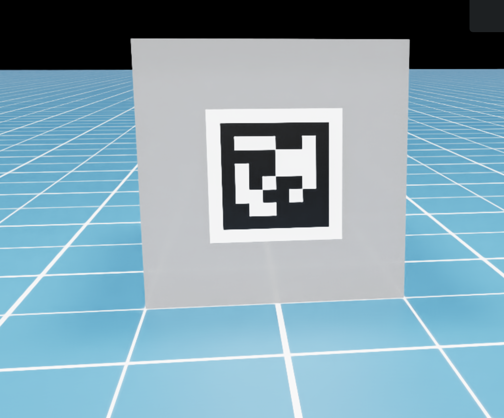
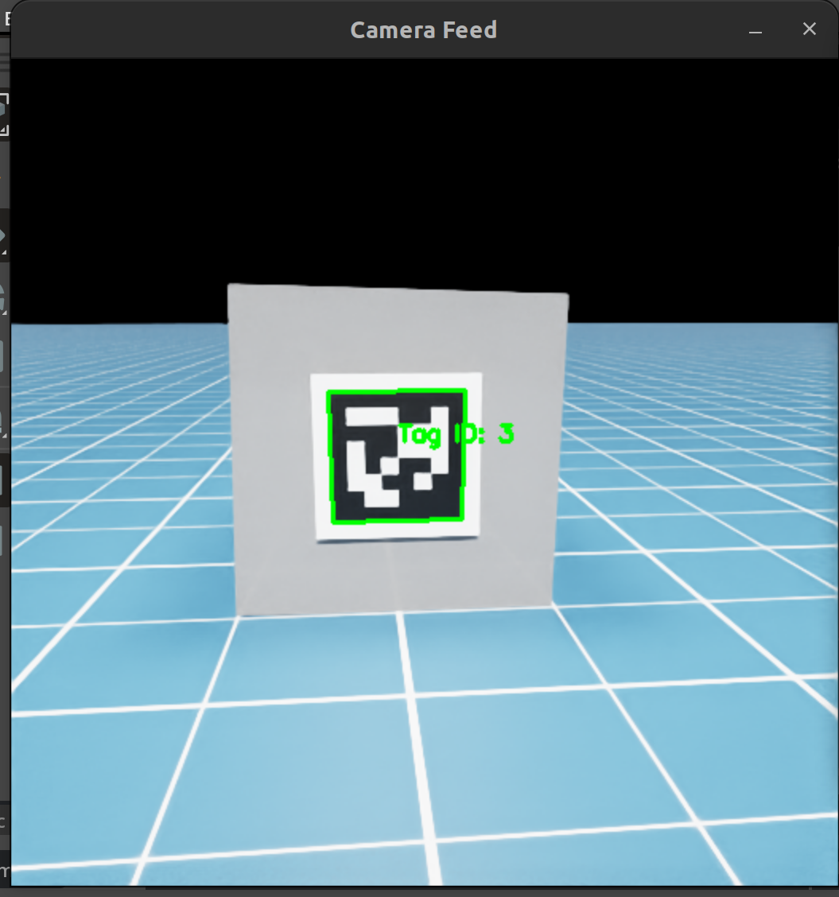
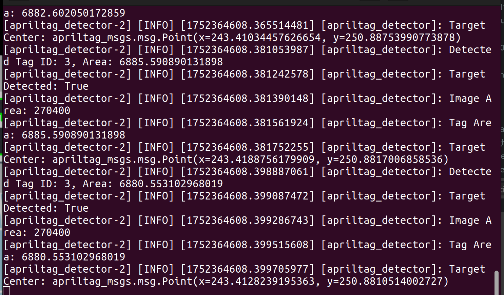
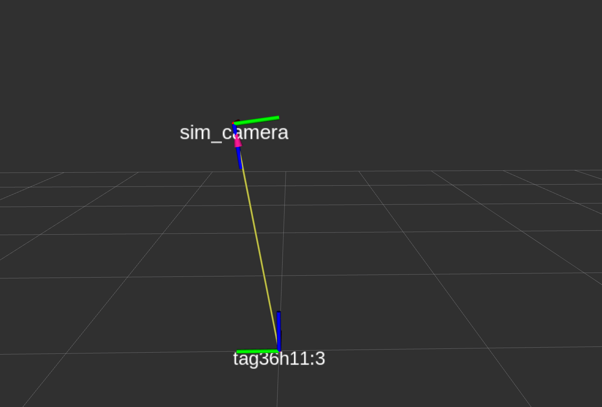

# Noham AprilTags Package

ROS2 package for AprilTag detection and pose estimation in Isaac Sim simulations.

## Overview

This package provides AprilTag detection capabilities for robotic systems, specifically designed to work with Isaac Sim simulations. It uses the `apriltag_ros` package for detection and publishes pose information for navigation and manipulation tasks.

## Features

- AprilTag detection using family 36h11
- Pose estimation and TF publishing
- Integration with Isaac Sim camera feeds
- Real-time detection and tracking

## Package Structure

```
noham_apriltags/
├── noham_apriltags/        # Python package
│   ├── __init__.py
│   └── apriltag.py         # AprilTag detector node
├── launch/                 # Launch files
│   └── noham_apriltag.launch.py
├── images/                 # Example images and documentation
├── usd/                    # USD files for Isaac Sim
└── test/                   # Test files
```

## Prerequisites

- ROS2 Humble or newer
- `apriltag_ros` package (included as submodule)
- Isaac Sim 4.5+ (for simulation)
- OpenCV and cv_bridge

## Installation

The package is part of the main workspace. Build it with:

```bash
cd ~/ros2_workspaces/noham_ws
colcon build --packages-select noham_apriltags
source install/setup.bash
```

## Usage

### Launch AprilTag Detection

```bash
ros2 launch noham_apriltags noham_apriltag.launch.py
```

This launch file starts:
- `apriltag_node`: AprilTag detection node from `apriltag_ros` package
- `apriltag_detector`: Custom detector node that processes detections and publishes poses

### Topics

**Subscribed:**
- `/rgb` - Camera image feed (remapped from `/image_rect`)
- `/camera_info` - Camera calibration information
- `/apriltag_detections` - AprilTag detections from `apriltag_ros`

**Published:**
- `/apriltag_poses` - Detected AprilTag poses
- TF transforms for detected tags

### AprilTag Configuration

The package uses AprilTag family **36h11** with ID **3** by default. Configuration is loaded from:
```
apriltag_ros/cfg/tags_36h11.yaml
```

## Example: AprilTag in Isaac Sim

The package includes an example implementation in Isaac Sim:

1. **Create a tagged cube**: A mesh cube with physical properties
2. **Add AprilTag texture**: A second mesh cube (depth 0.0001) with the AprilTag PNG as texture
3. **Attach with fixed joint**: The tag is attached to the main cube

**Result:**


## Launch Code Results

When running the detection:

**Camera Feedback:**


**Logs:**


**RViz2 TF Visualization:**


## AprilTag Image

The package uses AprilTag family 36h11 with ID 3:


## Integration with Other Packages

### Mobile Manipulator

The AprilTag detection is used by the mobile manipulator for:
- Object localization
- Approach planning
- Pick-and-place operations

The mobile manipulator behavior tree uses AprilTag poses to:
1. Navigate to the tag location
2. Approach the tag using mobile base
3. Plan arm movements relative to tag pose

### Navigation

AprilTag poses can be used as waypoints or landmarks for navigation tasks.

## Troubleshooting

### No Detections

1. **Check camera feed:**
   ```bash
   ros2 topic echo /rgb --no-arr
   ros2 topic echo /camera_info
   ```

2. **Verify AprilTag is visible**: Ensure the tag is in the camera's field of view and properly lit

3. **Check detection parameters**: Verify the tag family (36h11) and ID match your tag

### TF Transforms Missing

1. **Check TF tree:**
   ```bash
   ros2 run tf2_ros tf2_echo <parent_frame> <child_frame>
   ```

2. **Verify detector node is running:**
   ```bash
   ros2 node list
   ros2 topic list | grep apriltag
   ```

### Image Conversion Errors

If you encounter NumPy compatibility issues with cv_bridge:

```bash
pip install "numpy<2.0"
```

The package includes automatic NumPy compatibility handling, but manual downgrade may be needed in some cases.

## Configuration

### Customize Tag Family

Edit the launch file to use a different tag family:

```python
tags_yaml_file = os.path.join(apriltag_ros_share_dir, 'cfg', 'tags_<family>.yaml')
```

### Adjust Detection Parameters

Modify `apriltag_ros/cfg/tags_36h11.yaml` to adjust:
- Detection thresholds
- Tag size
- Camera parameters

## Dependencies

- `apriltag_ros` - AprilTag ROS wrapper (submodule)
- `sensor_msgs` - Image and camera info messages
- `apriltag_msgs` - AprilTag detection messages
- `cv_bridge` - OpenCV bridge for ROS2
- `tf2_ros` - Transform handling

## Testing

Run the test suite:

```bash
colcon test --packages-select noham_apriltags
```

## Related Packages

- `noham_bt` - Behavior trees that use AprilTag poses
- `isaacsim` - Simulation environment with AprilTag setup
- `apriltag_ros` - Core AprilTag detection package
